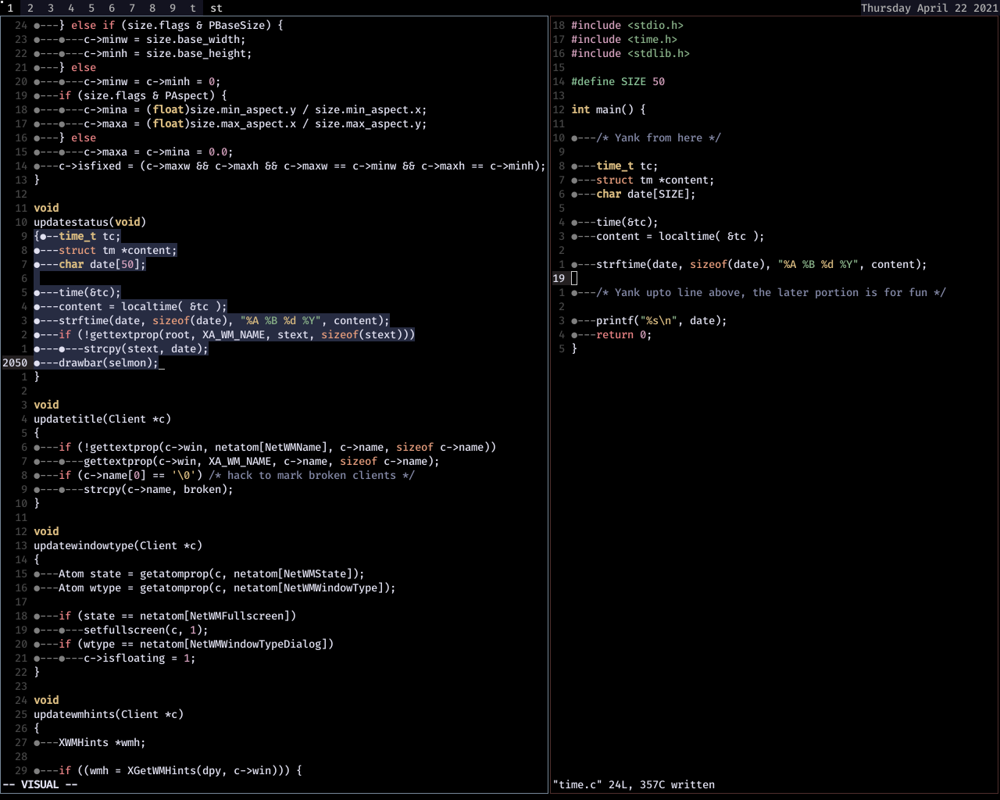

### Show date on statusbar -> DWM

Show current day of the week, date, month and year in dwm status bar. You'll need to manually edit `dwm.c` and include `#include <time.h>` as header file. Then jump to `updatestatus` function. It's probably on line 2045. If you're on vim, use `2045g` to jump to $line. Then add the stuff included in time.c to that function. One way to do it is to replace the contents within the function with the time.c contents. You'll need to put the value of `date` as an argument in the strcpy function where it copies the string value of date to `stext`.

You'll figure it out ^.^

If you like to have a clean status bar, without any junks, and `xsetroot` stuff, then this is the perfect way. Just kidding. Although I like a clean status bar, but sometimes I do have to check date and time for a quick reference. Thought this could be a good idea instead of using `xsetroot` during xorg init. How do I view time? Try mapping `notify-send "$(date)"` to some key combo.

Have fun!

**Here's a screenshot**

